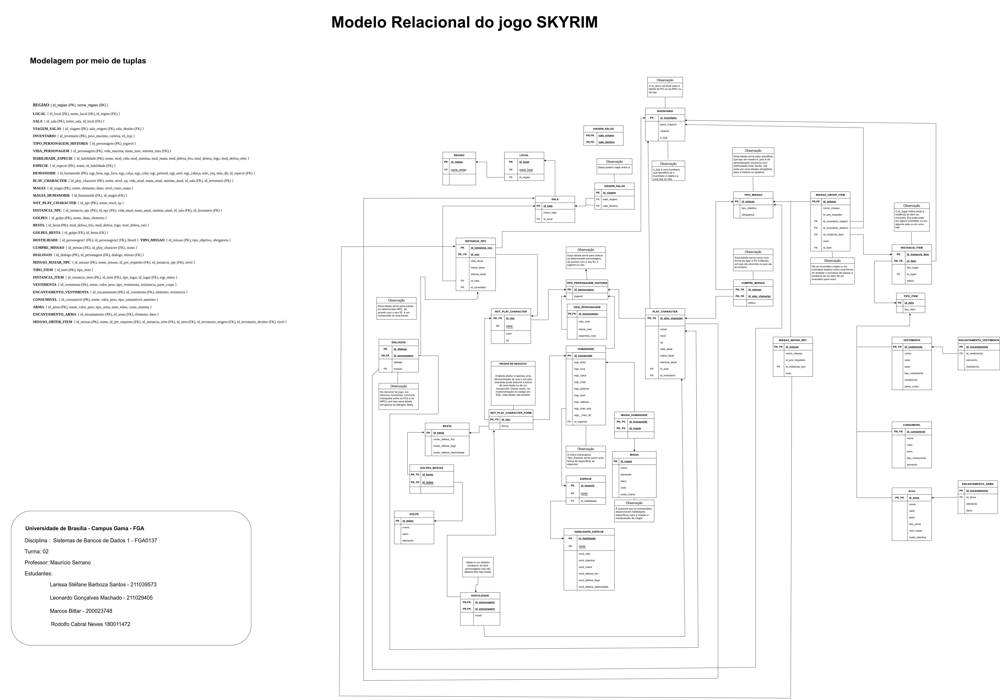

# Normalização

## Sumário

* [Mundanças que ocorreram](#Mundanças-que-ocorreram)

 * [Modelo Relacional Normalizado](#Modelo-Relacional-Normalizado)

 * [Dependências Funcionais](#Dependências-Funcionais)

 ## Mundanças que ocorreram
 
Após a criação do modelo relacional, foi necessário verificar se o projeto estava normalizado. Devido a isso, após a verificação foram necessárias fazer as seguintes mudanças:
  1. Criar uma tabela VIDA_PERSONAGEM com dados que eram redundantes.
  2. Ao invés de inventário referenciar os personagens a que pertencem, os personagens (Play character e instâncias de NPC) que possuem chave estrangeira para o inventário.
  3. Ao invés dos itens “VESTIMENTA” e “ARMA” terem o atributo de status, esse atributo foi passado para a “INSTANCIA_ITEM”.
  4. As tabelas “HOSTILIDADE” e “ALIADO” se fundiram em uma tabela chamada “HOSTILIDADE” com um atributo booleano chamado “hostil”, se for TRUE, então os dois personagens são inimigos, se FALSE, então são aliados.

## Modelo Relacional Normalizado

  
  Figura 1: Modelo Relacional Normalizado 

## Dependências Funcionais

  **Tabela REGIAO (id_regiao):**
  
  • id_regiao -> nome

  **Tabela LOCAL (id_local):**

 • id_local -> nome_local, id_regiao
 
**Tabela SALA (id_sala):**

  • id_sala -> nome_sala, id_local

**Tabela VIAGEM_SALAS (id_viagem):**

  • id_viagem -> sala_origem, sala_destino

**Tabela INVENTARIO (id_inventario):**

  • id_inventario -> peso_maximo, carteira, eh_loja
    
**Tabela TIPO_PERSONAGEM_HISTORIA (id_personagem):**

  • id_personagem -> jogavel

    
**Tabela VIDA_PERSONAGEM (id_personagem):**

 • id_personagem -> vida_maxima, mana_max, stamina_max

**Tabela HABILIDADE_ESPECIE (id_habilidade):**

 • id_habilidade -> nome, mod_vida, mod_stamina, mod_mana, mod_defesa_frio, mod_defesa_fogo, mod_defesa_eletr
 
**Tabela ESPECIE (id_especie):**

  • id_especie -> nome, id_habilidade

**Tabela HUMANOIDE (id_humanoide):**

  • id_humanoide -> eqp_bota, eqp_luva, eqp_calca, eqp_colar, eqp_peitoral, eqp_anel, eqp_cabeca, mao_esq, mao_dir, id_especie

**Tabela PLAY_CHARACTER (id_play_character):**

  • id_play_character -> nome, nivel, xp, vida_atual, mana_atual, stamina_atual, id_sala, id_inventario

**Tabela MAGIA (id_magia):**

  • id_magia -> nome, elemento, dano, nivel, custo_mana

**Tabela MAGIA_HUMANOIDE (id_humanoide, id_magia):**

 • id_humanoide -> id_magia
 
**Tabela NOT_PLAY_CHARACTER (id_npc):**

 • id_npc -> nome, nivel, xp
 
**Tabela INSTANCIA_NPC (id_instancia_npc):**

 • id_instancia_npc -> id_npc, vida_atual, mana_atual, stamina_atual, id_sala, id_inventario
 
**Tabela GOLPES (id_golpe):**

 • id_golpe -> nome, dano, elemento
 
**Tabela BESTA (id_besta):**

• id_besta -> mod_defesa_frio, mod_defesa_fogo, mod_defesa_raio

**Tabela GOLPES_BESTA (id_golpe, id_besta):**

• id_golpe -> id_besta

**Tabela HOSTILIDADE (id_personagem1, id_personagem2):**

  • id_personagem1 -> Hostil
  
  • id_personagem2 -> Hostil

**Tabela TIPO_MISSAO (id_missao):**

  • id_missao -> tipo_objetivo, obrigatoria
  
**Tabela CUMPRE_MISSAO (id_missao, id_play_character):**

  • id_missao -> status
    
  • id_play_character -> status
    
**Tabela DIALOGOS (id_dialogo, id_personagem):**

  • id_dialogo -> dialogo, missao
  
  • id_personagem -> dialogo, missao
  
**Tabela MISSAO_MATAR_NPC (id_missao):**

  • id_missao -> nome_missao, id_pre_requisito, id_instancia_npc, nivel
    
**Tabela TIPO_ITEM (id_item):**

  • id_item -> tipo_item
  
**Tabela INSTANCIA_ITEM (id_instancia_item, id_item):**

  • id_instancia_item -> tipo_lugar, id_lugar, eqp_status
  
  • id_item -> tipo_lugar, id_lugar, eqp_status
  
**Tabela VESTIMENTA (id_vestimenta):**

  • id_vestimenta -> nome, valor, peso, tipo_vestimenta, resistencia, parte_corpo
  
T**abela ENCANTAMENTO_VESTIMENTA (id_encantamento):**

  • id_encantamento -> id_vestimenta, elemento, resistencia
    
**Tabela CONSUMIVEL (id_consumivel):**

  • id_consumivel -> nome, valor, peso, tipo_consumivel, aumento
    
**Tabela ARMA (id_arma):**

  • id_arma -> nome, valor, peso, tipo_arma, num_mãos, custo_stamina
    
**Tabela ENCANTAMENTO_ARMA (id_encantamento):**

  • id_encantamento -> id_arma, elemento, dano
  
**Tabela MISSAO_OBTER_ITEM (id_missao):**

  • id_missao -> nome, id_pre_requisito, id_instancia_item, id_item, id_inventario_origem, id_inventario_destino, nivel

## Histórico de Versão

| Versão | Alteração | Responsável | Revisor | Data |
| - | - | - | - | - |
| 1.0 | Normalização | Larissa Stéfane | - | 27/10/2023
| 2.0 | Normalização | Larissa Stéfane | - | 30/10/2023

    
