# Consultas

Abaixo estão os códigos SQL das consultas e seus resultados no PostreSQL após sua execução:

  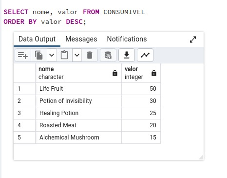
  
  Figura 1: Consumíveis mais caros

  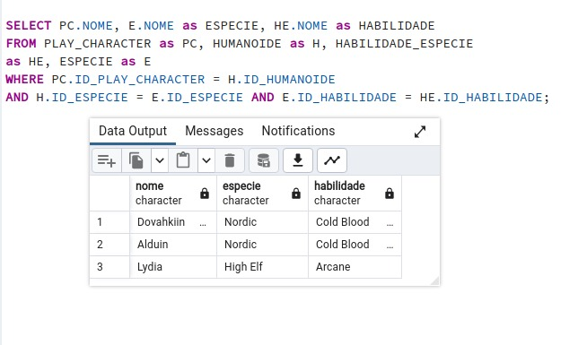
  
  Figura 2: Selecionar as habilidades de um personagem humanoide

  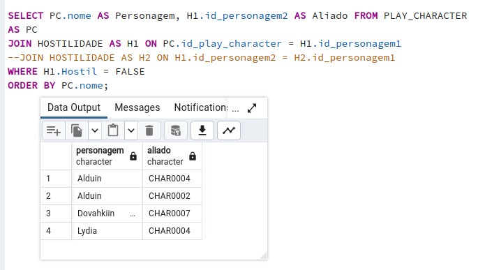
  
  Figura 3: Listar os aliados de um PC

  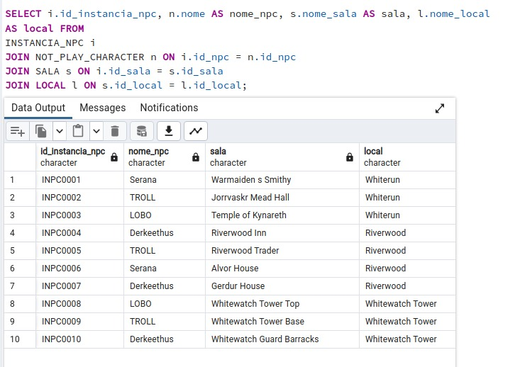
  
  Figura 4: Localização de uma instancia de um NPC

  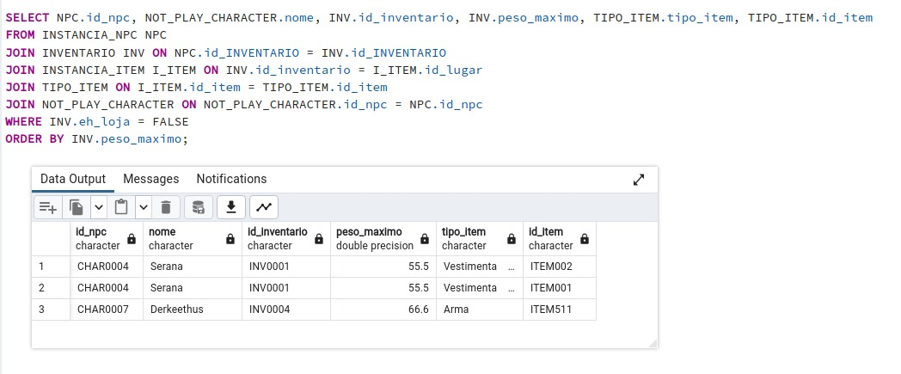
  
  Figura 5: Mostrar os itens em um inventário de cada NPC que não seja loja

  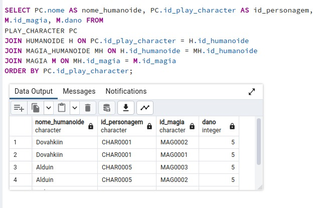
  
  Figura 6: Selecionar magias de um personagem humanoide

  

  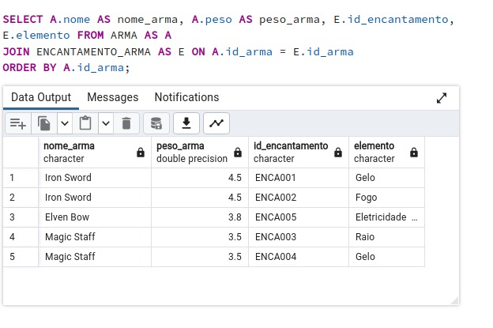
  
  Figura 7: Armas com encantamento

  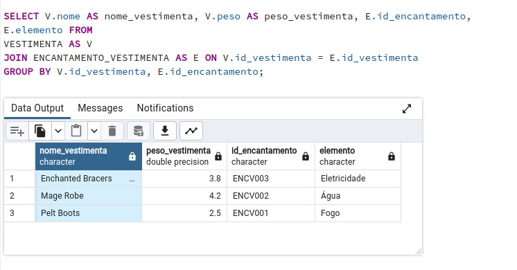
  
  Figura 8: Vestimentas com encantamento

  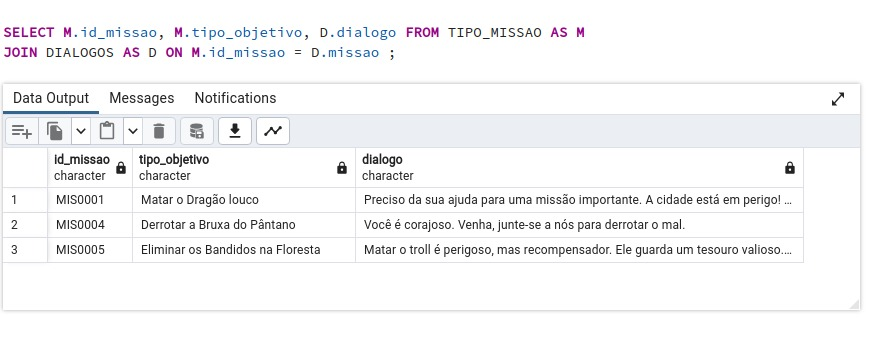
  
  Figura 9: Os diálogos de uma missão

  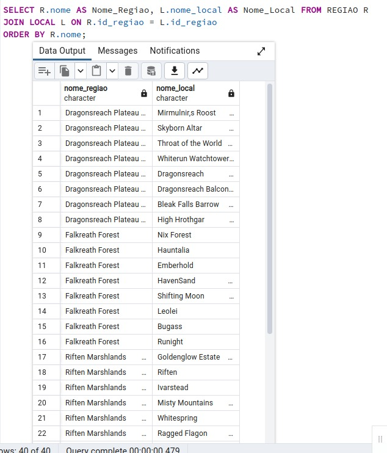
  
  Figura 10: Locais de uma região

  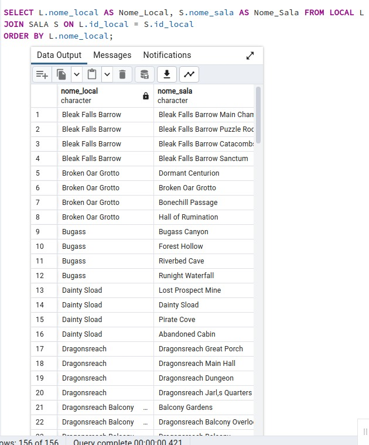
  
  Figura 11: Salas de um local

## Histórico de Versão

| Versão | Alteração | Responsável | Revisor | Data |
| - | - | - | - | - |
| 1.0 | Consultas | Leonardo Gonçalves | Larissa Stéfane | 27/10/2023
| 2.0 | Consultas | Leonardo Gonçalves | Larissa Stéfane | 30/10/2023

