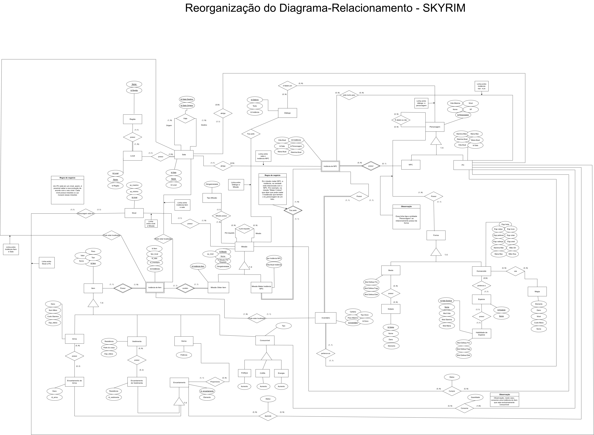

# Atualização do DER

Após o feedback do professor, foi replanejada a organização e a estrutura do Diagrama de Entidade relacionamento.

## Sumário
* [Mudanças](#Mudanças)
 * [Diagrama](#Diagrama)
 * [Histórico de Versão](#Histórico-de-Versão)
 
  ## Mudanças:
  As principais mudanças que ocorreram foram:
  
  1 - Reoganização da especialização da forma com base em uma entidade de forma.
    
  2 - Para desenvolver o play_character foi adotada uma entidade Nível.
    
  3 - Foi criada uma entidade Gema que será utilizada para realizar os encantamentos.
    
  4 - Foi criado um relacionamento de consumo entre os play_character e os consumíveis.
    
  5 - Para desenvolver o PC durante o jogo, foi desenvolvido um relacionamento de aprendizado de feitiços.
    
  6- Para desenvolver o PC, magia possui um nível específico.
    
  7 - Para um instância poder apontar para dois lugares que podem estar, ela tem um relacionamento de possibilidade com relação ao inventário e à sala. Isso também é útil para saber quais instância estão localizadas em lojas.
    
  8 - O relacionamento com diálogo passou a ser com a entidade Personagem (envolve tan PCs quanto NPCs) e com as missões.
    
  9 - Nas missões de matar NPCs, será realizado um procede para verificar o tipo de PC, a instância é só para indicar que mata instância e não o PC em si.

## Diagrama:

  O diagrama pode ser observado por meio da imagem abaixo. No entanto, se desejar visualizá-lo de modo mais legível, é possivel por meio de 

- Diagrama em PDF no [link](ReorganizaçãoDER_Edicao2.0.pdf)
- Driagrama em Drawio no [link](ganizaçãoDER_Edicao2.0.drawio)
- Diagrama em PNG no [link](ReorganizaçãoDER_Edicao2.0.png)

  ### Versão Atualizada:

    O Diagrama foi corrigido e reestruturado

  

  ## Histórico de Versão
| Versão | Alteração | Responsável | Revisor | Data |
| - | - | - | - | - |
| 1.0 | Criaçao do novo DER| Larissa Stéfane | - | 22/11/2023
| 2.0 | Criaçao do md| Larissa Stéfane | - | 01/12/2023
  
    
