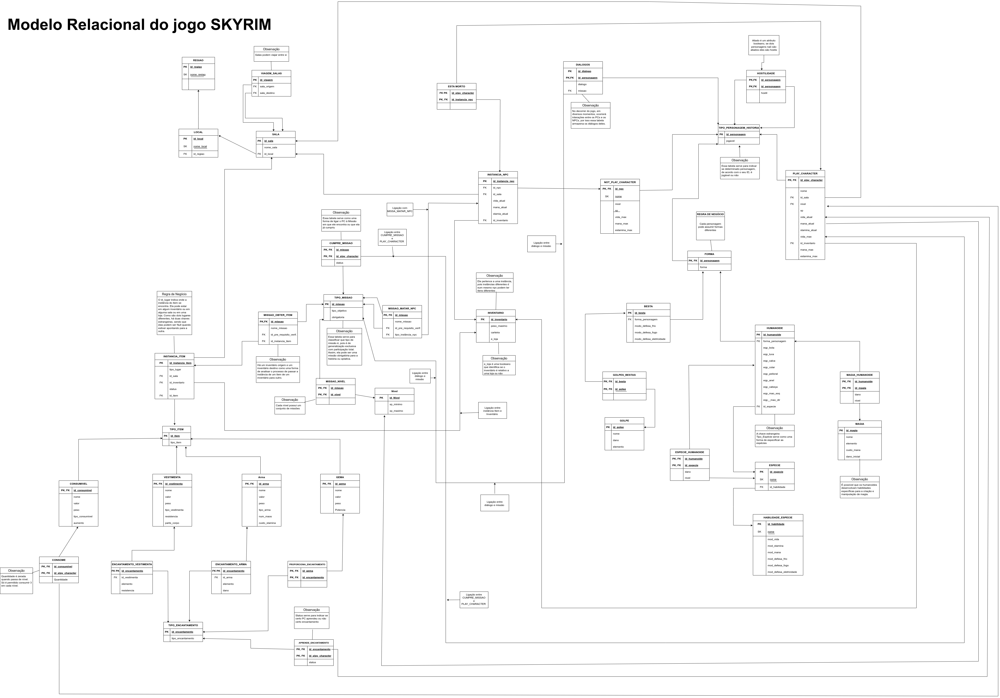

# Atualização do Modelo Relacional

Após a correção do professor e com o novo Diagrama de Entidade e Relacionamento, uma série de mudanças foram feitas no MER junto com a sua reestruturação.

## Sumário
* [Mudanças](#Mudanças)
 * [Modelo Relacional](#Modelo-Relacional)
 * [Histórico de Versão](#Histórico-de-Versão)

##  Mudanças:
  As principais mudanças que ocorreram foram:

  1 - 

## Modelo Relacional:

O modelo relacional pode ser observado por meio da imagem abaixo. No entanto, se desejar visualizá-lo de modo mais legível, é possivel por meio de 

- MER em PDF no [link](ModeloRelacionalSkyrim_Reorganização_2.00.pdf)
- MER em Drawio no [link](ModeloRelacionalSkyrim_Reorganização_2.00.drawio)
- MER em PNG no [link](ModeloRelacionalSkyrim_Reorganização_2.00.png)

  ### Versão Atualizada:

    Foram corrigidos o últimos detalhes do Modelo Relacional.

  
  Figura: Modelo Relacional reestruturado

## Histórico de Versão

| Versão | Alteração | Responsável | Revisor | Data |
| - | - | - | - | - |
| 1.0 | Criaçao do novo MER| Larissa Stéfane | - | 24/11/2023
| 2.0 | Criaçao do md| Larissa Stéfane | - | 01/12/2023
  
