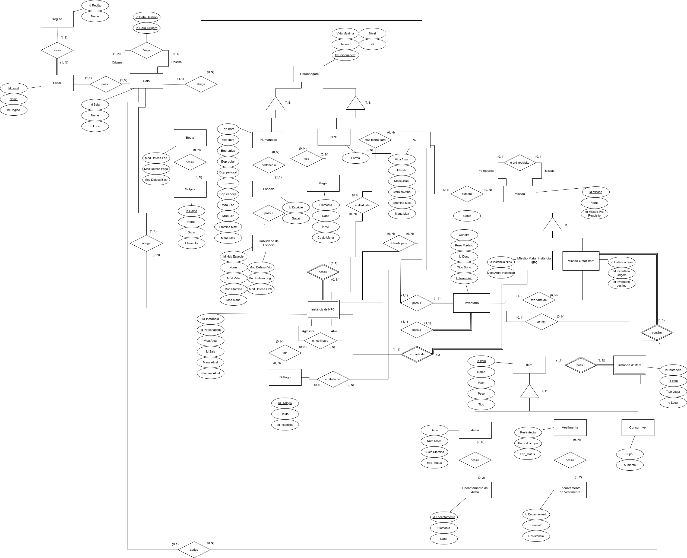

# MER/DER - Modelo/Diagrama Entidade-Relacionamento

## Introdução

O primeiro passo para o desenvolvimento de um SGBD é a formulação de um projeito conceitual. Este nada mais é do que o mais alto nível de abstração de um Sistema de Banco de dados. Utilizamos o Modelo Entidade-Relacionamento, que abstrai conceitos, ideias e objetos do mundo real em conjuntos de entidades, que representarão tabelas no projeto conceitual, e também abstrai as conexões entre esses conjuntos de entidades, que são os conjuntos de relacionamento.

## Modelagem

Desse modo, apresenta-se abaixo o Diagrama Entidade-Relacionamento desenvolvido para o jogo Skyrim.

### Versão 1.0

  
  Figura 1: DER 1.0

## Bibliografia

[1] SERRANO, M. Modelo Entidade-Relacionamento Parte 1. Adaptado de SOUSA E., JUNIOR J. Disponível em [link](https://aprender3.unb.br/pluginfile.php/2686545/mod_resource/content/1/Aula03_MER_Parte1.pdf)

[2] SERRANO, M. Modelo Entidade-Relacionamento Parte 2. Adaptado de SOUSA E., JUNIOR J. Disponível em [link](https://aprender3.unb.br/pluginfile.php/2686547/mod_resource/content/1/Aula04_MER_Parte2.pdf)

[3] SERRANO, M. MER-X Agregação. Adaptado de SOUSA E., JUNIOR J. Disponível em [link](https://aprender3.unb.br/pluginfile.php/2686549/mod_resource/content/1/Aula05_Agregacao.pdf)

[4] SERRANO, M. MER-X Generalização/Especialização. Adaptado de SOUSA E., JUNIOR J. Disponível em [link](https://aprender3.unb.br/pluginfile.php/2686551/mod_resource/content/1/Aula06_Generalizacao.pdf)