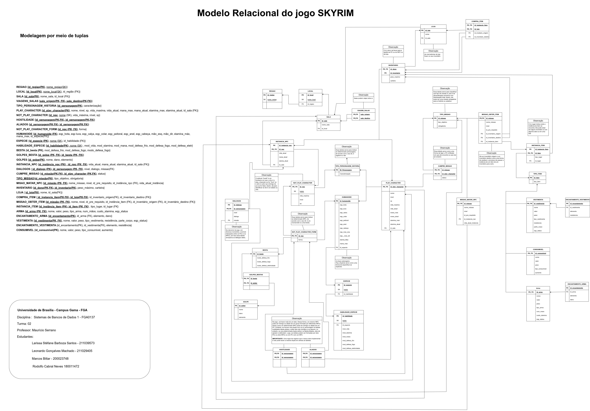
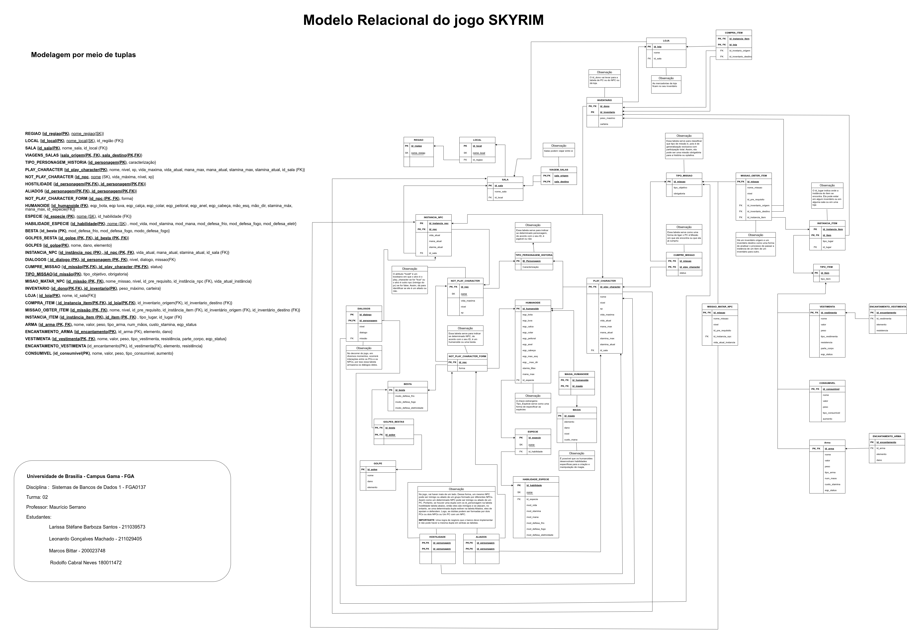

# MREL - Model Relacional

## Introdução

Após o desenvolvimento do projeto conceitual de um sistema de banco de dados, faz-se necessário realizar o seu projeto lógico. Desse modo, a espinha dorsal desta etapa do projeto é o desenvolvimento do modelo relacional, o qual estabele a organização do banco por meio de tabelas e permite a comunicação de como os dados estão estruturados.

## Modelagem

Desse modo, apresenta-se abaixo o modelo relacional desenvolvido para o jogo skyrim. Em seu lado esquerdo, há a representação do modelo em formato de notação de relacionamento enquanto à direita há a representação por meio de tabelas.

### Versão 1.0

  
  Figura 1: Modelo Relacional 1.0

### Versão 2.0

Foi verificado que os humanoides possuem a possibilidade de usarem e praticarem magia. Desse modo, foi adicionado ao MREL a tabela "MAGIA_HUMANOIDE" a qual conecta o humanoide a magia que utiliza e também foi criada a tabela "MAGIA", a qual contém as informações da magia específica utilizada.

  
  Figura 2: Modelo Relacional 2.0

## Bibliografia

[1] SERRANO, M. Modelo Relacional. Adaptado de SOUSA E., JUNIOR J. Disponível em [link](https://aprender3.unb.br/pluginfile.php/2686556/mod_resource/content/1/Aula07_Relacional.pdf)

[2] SERRANO, M. Mapeamento entre Esquemas Parte 1. Adaptado de SOUSA E., JUNIOR J. Disponível em [link](https://aprender3.unb.br/pluginfile.php/2686558/mod_resource/content/1/Aula08_MapeamentoMER-REL-parte1.pdf)

[3] SERRANO, M. Mapeamento entre Esquemas Parte 2. Adaptado de SOUSA E., JUNIOR J. Disponível em [link](https://aprender3.unb.br/pluginfile.php/2686560/mod_resource/content/2/Aula09_MapeamentoMER-REL-parte2.pdf)

